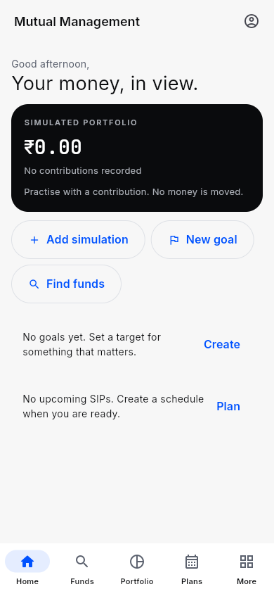
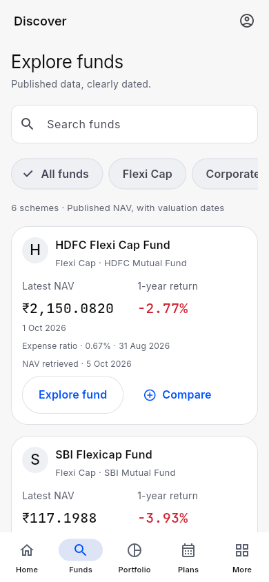
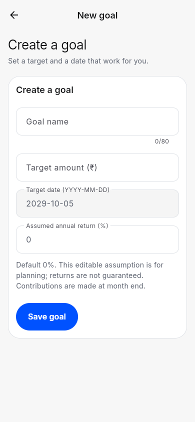
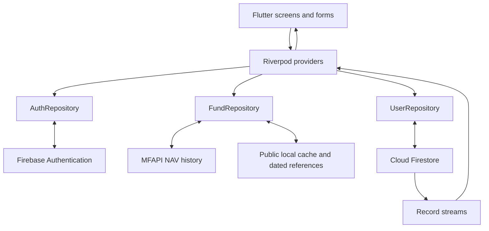

# Mutual Management

A beginner-friendly app for exploring Indian mutual funds, setting goals and practising investment decisions. Built for **case study 132, “Grow Mutual Fund Investment”**, it brings fund research, planning, portfolio analysis and learning into one Flutter application for Android and the web.

**Release:** 1.1.0 · **Documentation reviewed:** 5 October 2026 · **Maintainer:** [kadamsahil2511](https://github.com/kadamsahil2511)

[Open the app](https://mutual-management.vercel.app) · [Download Android APK](https://github.com/kadamsahil2511/mutual-management/releases/download/v1.1.0/mutual-management-v1.1.0.apk) · [Release notes](https://github.com/kadamsahil2511/mutual-management/releases/tag/v1.1.0) · [Demo guide](docs/DEMO.md) · [CI results](https://github.com/kadamsahil2511/mutual-management/actions)

[Complete project documentation (PDF)](docs/Groww_Mutual_Management.pdf) · [Download PDF](https://raw.githubusercontent.com/kadamsahil2511/mutual-management/main/docs/Groww_Mutual_Management.pdf)

The 20-page project report is available directly in this repository. Its [editable Notion source](https://app.notion.com/p/3f0639f172f181b78f66eb33147e49c2) requires workspace access. Additional guides are linked below.

> Accounts, cloud records and published fund data are real. Every contribution and SIP installment is an explicitly confirmed simulation. No money moves, and the app does not execute investment orders.

## Project purpose and audience

Learning about mutual funds often means moving between fund pages, calculators, educational resources and spreadsheets. Mutual Management brings a small, traceable selection of these tools together so a beginner can understand the process before making financial decisions elsewhere.

The project is intended for students, first-time learners and classroom demonstrations. Its objectives are to make fund information understandable, support goal-based practice, explain diversification and risk, and demonstrate a complete cross-platform application with persistent user records.

## Start using the app

- **Web:** Open the [live application](https://mutual-management.vercel.app) in a browser.
- **Android:** Install the [signed 1.1.0 APK](https://github.com/kadamsahil2511/mutual-management/releases/download/v1.1.0/mutual-management-v1.1.0.apk) on Android 7.0 / API 24 or newer. Android may require permission for the browser or file manager to install it. This is an APK distribution, not a Play Store listing.
- **Guests:** Explore funds, compare schemes, complete the risk questionnaire, read articles and use calculators.
- **Account holders:** Save goals, create SIP schedules, record simulations and see the same records on another signed-in device. New accounts start empty.
- **Updating:** Version 1.1.0 uses the same Android package and signing certificate as 1.0.0. Install it over the earlier release to retain the app's local state.

## Screens and capabilities

On phones, the five primary tabs are **Home, Funds, Portfolio, Plans and More**. More contains account and learning tools. Wider screens use the desktop navigation.

| Area | What users can do |
|---|---|
| Home / Overview | See simulated portfolio value, gain/loss, goal progress, the next planned SIP and quick actions. |
| Funds | Search six schemes, filter three categories and select two or three funds for comparison. |
| Fund details | Explore Overview, Performance and Holdings; inspect dated NAV, returns, benchmark figures, AUM, expense basis, managers and separate SIP/lump-sum minimums. |
| Risk comfort | Answer five questions about time horizon, emergency savings, reaction to loss, experience and flexibility. The result is an educational reflection. |
| Portfolio | Review derived holdings, contributed amounts, valuation, gain/loss, sector allocation and disclosed-security overlap. |
| Plans | Create/edit goals, choose monthly or quarterly SIP schedules, confirm due installments and cancel future recording. |
| Activity and receipts | Review recorded simulations and open their amount, units, NAV/date and effective-date details. |
| Account and recovery | Register, sign in, view account information, request a password reset and sign out. |
| Learn | Read six original articles and open official educational videos and sources. |
| Calculators | Explore SIP, lump-sum and goal estimates with editable assumptions. |
| Fixed deposits | Review dated published bank rates and tenures, open bank sources and estimate maturity. |
| More / About | Find tools, account access, contribution activity and an explanation of the simulation. |

Goal creation/editing, SIP creation and contribution recording have dedicated mobile screens. Forms resize for the keyboard; dragging dismisses it. Details and forms provide Back navigation, and web routes support direct links.

## A complete demonstration

1. Open **Funds**, search or swipe category filters, select two funds and compare them. Open a fund's details to inspect its NAV date and separately dated reference information.
2. Open **More → Risk comfort** and complete the five questions.
3. Open the account icon and create an account with a name, email and password of at least eight characters. The portfolio begins empty.
4. In **Plans → Goals → Create goal**, enter “Education”, a ₹1,20,000 target and a future date. Keep the assumed annual return at 0% to see a contribution-only plan.
5. In **Plans → SIPs → Create SIP plan**, choose a fund, ₹1,000, a monthly schedule and a first date that is already due. Optionally link the goal.
6. Select the due installment, review the historical NAV/date and calculated units, then choose **Confirm simulation**. Nothing is recorded automatically.
7. Open **Portfolio**, inspect the holding and add a second fund through **Add simulation** to demonstrate overlap. Open **Activity** and a receipt.
8. Reload or sign in on a second device to demonstrate persistence and synchronization. Try a calculator, then sign out on shared devices.

Choose a recent due date with available NAV history; recording rejects an unusable price gap. A demonstration amount still requires review and confirmation. See the [detailed walkthrough](docs/DEMO.md).

## How the simulation works

| Rule | Behavior |
|---|---|
| Contribution valuation | Units equal the rupee amount divided by the published NAV used for that record. |
| One-off contributions | Use the latest available published NAV, with date/freshness checks. |
| SIP installments | Use NAV on or before the scheduled date, with a seven-day data-gap limit. Recording requires explicit confirmation. |
| Monthly and quarterly dates | Keep the original day and clamp only the shorter month: January 31 → February 28/29 → March 31. |
| Duplicate protection | A deterministic SIP/date record ID and Firestore transaction prevent the same installment being saved twice. |
| Portfolio totals | Derive from immutable contribution records; there is no separately maintained balance. |
| Goal progress | Tracks contributed amounts. Planning estimates use an editable assumed return, default 0%, and end-of-month contributions. |
| Returns | 1Y is an absolute return; 3Y/5Y are annualized. Insufficient history stays unavailable. |
| Portfolio X-ray | Sector weights use portfolio values; overlap sums the smaller disclosed weight for each matching security identifier. |

A tested example: ₹1,000 at NAV ₹25 gives 40 units; ₹500 at NAV ₹20 adds 25 units. At NAV ₹24, the 65 units are worth ₹1,560, a ₹60 gain. This is a test example, not seeded account data.

## Data, sources and freshness

The catalogue contains six **Direct Growth** schemes:

| Category | HDFC scheme code | SBI scheme code |
|---|---|---|
| Flexi Cap | 118955 | 119718 |
| Corporate Bond | 118987 | 146215 |
| Aggressive Hybrid | 119062 | 119609 |

- **NAV and history:** MFAPI responses are fetched by scheme code. The app displays the actual NAV valuation date separately from the retrieval/cache date. Successful public responses are cached for six hours, with refresh, a ten-second request timeout, one retry and labelled cached fallback.
- **Scheme references:** Expense basis, AUM, managers, benchmark comparisons and minimums come from dated AMC disclosures. The main factsheet snapshot is 31 August 2026; separately checked minimums retain their own source date.
- **Holdings:** Available top-holding disclosures are partial. Coverage and unreported assets remain visible; debt issuer aggregates are not presented as individual identified securities.
- **Expense comparison:** The HDFC and SBI disclosures use different expense bases. “Selected-category average · 2 funds” is shown as unavailable where a comparable average cannot be calculated.
- **Bank deposits:** Rates are bundled dated snapshots from HDFC Bank and SBI, not a live bank feed. The maturity calculator illustrates quarterly compounding before tax; bank terms determine actual proceeds.
- **Education:** Six original summaries cover mutual funds, NAV, risk, expenses, direct/regular plans and the Riskometer, with official AMFI/SEBI sources and videos.
- **Missing data:** Failed requests and unavailable fields remain explicit. The app does not generate replacement market figures.

The [data-source guide](docs/DATA_SOURCES.md) records official source links, disclosure dates, expense definitions, minimum-investment provenance and coverage limitations.

## Design and accessibility

The visual identity follows [DESIGN.md](DESIGN.md): blue `#0052ff`, white/gray surfaces, dark overview cards, Inter text, JetBrains Mono financial figures, 24px card corners, 12px inputs and pill-shaped actions.

Version 1.1 introduced a compact mobile dashboard, visible bottom tabs, horizontally scrollable fund filters, focused detail sections, separate forms, receipts and a More hub. Desktop retains the wider editorial layout. Content is capped at 1200px, with compact phone padding and adaptive card layouts.

Verification covers narrow screens, large desktop widths, 200% text scaling, 48px interaction targets and Android portrait/landscape. Financial rows stack when needed. The [mobile UX audit](docs/MOBILE_UX_AUDIT.md) explains the findings and fixes.

  

[More hub](screenshots/mobile-v1.1-more.png) · [Fund details](screenshots/mobile-v1.1-fund-detail.png) · [Desktop overview](screenshots/mobile-v1.1-home-desktop-1280.png) · [Android keyboard](screenshots/android-v1.1-keyboard.png)

## Key terms

The main financial terms used in the app are:

| Term | Meaning in this project |
|---|---|
| NAV | Published value of one fund unit; used to calculate simulated units and valuation |
| SIP | A recurring contribution schedule; each due installment here needs manual confirmation |
| AMC | The asset management company managing a fund, such as HDFC Mutual Fund or SBI Mutual Fund |
| AUM | Assets under management reported for a scheme at its disclosure date |
| Benchmark | A reference index used for a separately dated performance comparison |
| CAGR | An annualized rate describing growth over a multi-year period |
| Overlap | Shared identified securities between two funds, limited to disclosed holdings |

## Technology and architecture

| Layer | Technology and role |
|---|---|
| App and language | Flutter 3.47.1 / Dart 3.13.1; shared web and Android application code |
| UI | Material 3, ordinary widgets, bundled fonts and responsive layouts |
| Shared state | Riverpod providers; local `setState` for temporary form and selection state |
| Navigation | `go_router` for destinations, deep links and Back behavior |
| Authentication | Firebase Authentication email/password accounts and session changes |
| Cloud records | Cloud Firestore documents with real-time streams and owner-only rules |
| Public data | `http` requests to MFAPI plus bundled dated reference snapshots |
| Local storage | `shared_preferences` for public NAV cache |
| Utilities | `intl` for currency/dates; `url_launcher` for external sources and videos |
| Delivery | Vercel static web hosting; a signed Android APK; Git/GitHub releases |
| Verification | Flutter tests/integration tests, Firestore Emulator, GitHub Actions; Node 22 and Java 21 for emulator testing |



The three concrete repositories keep network and database work separate from widgets. Saving a goal validates the form, checks sign-in, writes through `UserRepository`, and receives the updated record through a Firestore stream. Riverpod then updates Home and Plans. The app connects directly to Firebase and the public API; this release has no custom application server.

### Code and data map

- `lib/features/`: auth, overview, funds, plans, portfolio, learn, deposits and More.
- `lib/core/`: providers, theme, shared widgets, input validation and calculations.
- `lib/app.dart`: routes and responsive navigation; `lib/main.dart`: startup.
- `assets/data/`: learning content and dated FD rates; `assets/fonts/`: bundled fonts and licenses.
- `test/`, `integration_test/`, `firebase-tests/`: calculation, UI, device and security checks.
- `firestore.rules`, `firebase.json`, `scripts/package-web.sh`: backend rules/emulators and web packaging.

Personal collections are scoped to `mutualManagementUsers/{uid}`:

| Record | Stored information |
|---|---|
| Goal | Name, target amount in integer paise, target date and assumed return |
| SIP | Scheme code, amount in paise, start date, monthly/quarterly interval, optional goal and active/cancelled status |
| Contribution | Amount, units, NAV, NAV date, effective date, scheme code and optional SIP/goal association |

Authentication stores account identity and display name. Calendar dates use UTC midnight in stored models. Private Firestore disk persistence is disabled; SharedPreferences is used for public prices. Firebase Auth maintains the sign-in session until sign-out. Rules validate ownership, record shape and positive amounts, and contributions are immutable through client access.

## Run and configure locally

Prerequisites: Flutter 3.47.1 / Dart 3.13.1, a browser, and an Android SDK/device for Android work. Node 22 and Java 21 are used for Firestore emulator checks.

```sh
git clone https://github.com/kadamsahil2511/mutual-management.git
cd mutual-management
flutter pub get
flutter run -d chrome
# For Android, choose an ID from flutter devices:
flutter run -d DEVICE_ID
```

The checked-in Firebase client configuration connects to `device-streaming-f3ea5c85`, displayed as Mutual Management, with Firestore in `asia-south1`. Client identifiers are not administrator credentials. Service-account keys, account passwords and release-signing secrets are excluded from the repository.

For an independent deployment, register Firebase web and Android apps, use Android package `com.kadamsahil.mutual_management`, replace `lib/firebase_options.dart`, update `.firebaserc`, enable Email/Password Auth, create Firestore and deploy the included rules. Add the deployed web hostname to Auth's authorized domains.

For local backend development, start Auth and Firestore emulators before running the emulator-enabled app:

```sh
npm ci --prefix firebase-tests
firebase-tests/node_modules/.bin/firebase emulators:start --only auth,firestore --project demo-mutual-management
# In another terminal:
flutter run -d chrome --dart-define=USE_EMULATORS=true
```

Android emulator builds use host `10.0.2.2`; web uses `127.0.0.1`. Starting the local services alone does not redirect an ordinary app run; pass `USE_EMULATORS=true`.

## Testing and release evidence

Version 1.1 evidence records **45 passing Flutter unit/widget tests**, **one Android API 35 integration test**, and **six Firestore security tests**. Tests cover validation, NAV failures/cache/retry, numerical calculations, duplicate recording, schedule boundaries, ownership and immutable records.

Responsive checks cover 320, 390, 640, 768, 1024, 1050, 1100, 1280 and 1920px, including 200% text. The signed APK was installed and launched on API 35; portrait, landscape and keyboard behavior were inspected. API 24 is the supported build minimum, not a device-test claim.

```sh
dart format --output=none --set-exit-if-changed lib test integration_test
flutter analyze
flutter test
npm ci --prefix firebase-tests
firebase-tests/node_modules/.bin/firebase emulators:exec --only firestore --project demo-mutual-management 'npm --prefix firebase-tests test'
flutter test integration_test/app_test.dart -d emulator-5554
```

The Firestore test command uses a demo project. Android integration requires a running device with the selected ID. GitHub Actions runs formatting, analysis, Flutter tests, a web build and Firestore security tests on pushes and pull requests; Android device testing is run separately.

Production verification also covered registration, account isolation, two-client synchronization, goal/SIP creation, explicit contribution recording and persistence. Details and historical release distinctions are in [verification evidence](docs/VERIFICATION.md).

## Build and release

```sh
./scripts/package-web.sh
vercel link --project mutual-management --scope ksahil-team
vercel deploy --prebuilt
# After checking the preview:
vercel deploy --prebuilt --prod
```

The script packages Flutter's static web build using Vercel Build Output API v3, with a filesystem-first fallback to `index.html` for application routes.

```sh
MUTUAL_SIGNING_PROPERTIES=/absolute/private/path/signing.properties flutter build apk --release
```

The external properties file contains `storeFile`, `storePassword`, `keyAlias` and `keyPassword`. Keep it and the keystore outside Git and back them up privately for future updates. Without this variable, local builds use development signing. The signed APK is produced at `build/app/outputs/flutter-apk/app-release.apk`.

Release 1.1.0 uses version code 2 and supports Android API 24+. Its [release page](https://github.com/kadamsahil2511/mutual-management/releases/tag/v1.1.0) includes the APK and checksum file.

## Limitations and troubleshooting

| Situation | Explanation or action |
|---|---|
| A new portfolio is empty | This is expected. Create a plan or explicitly confirm a simulated contribution. |
| A price is cached or unavailable | Check its NAV date, restore connectivity and refresh/retry. Existing public cache may be shown with a warning. |
| An installment cannot be recorded | Check the scheduled date, available history and the seven-day price-gap limit. Already-recorded installments cannot be duplicated. |
| Goal estimate seems high | Check target/date and the assumed return. The default is 0%; no growth is assumed. |
| Allocation or overlap is incomplete | Only disclosed, identified holdings are included. Coverage and unreported assets are shown. |
| The expense average is unavailable | The selected disclosures use incompatible expense definitions; the app avoids a misleading average. |
| A form asks for sign-in | Saving personal records requires an account. After sign-in, the pending form remains available. |
| Sign-in or reset fails | Check email, password and connectivity. Use the reset screen; on custom deployments verify Firebase Auth configuration and authorized domains. |

This release has six selected funds, manually curated reference/rate snapshots, partial holdings and educational risk guidance. There are no automatic debits, withdrawals, bank connections, real fund orders, live FD bookings or stock trading. The pricing-reference panel reproduces labelled case-study examples, not financial offers. Calculator outputs are assumptions, not promised returns.

Account deletion/export, additional funds, broader complete holdings coverage and automated reference refresh are **possible future work**, not delivered features.

## Academic mapping and project history

The software implements case study 132 and the final assignment's app requirements: multiple screens, Riverpod, API/Firestore integration, validation, local storage, Material 3, feature folders, repository separation and automated checks. See the [syllabus mapping](docs/SYLLABUS.md) and [source requirements](docs/SOURCE_REQUIREMENTS.md).

Version 1.0 established the end-to-end application and verified cloud/data flows. Version 1.1 addressed the mobile UX audit with app navigation and focused task screens. Both releases and genuine incremental commits are preserved. Classroom participation, handwritten work, peer assessment and the instructor's live surprise-feature exercise are separate activities.

## Documentation index

| Document | Purpose |
|---|---|
| [Project documentation (PDF)](docs/Groww_Mutual_Management.pdf) | Complete 20-page project report, exported from Notion and publicly available in this repository |
| [Notion project handbook](https://app.notion.com/p/3f0639f172f181b78f66eb33147e49c2) | Complete project documentation in Notion; workspace access required |
| [Demo guide](docs/DEMO.md) | Installation, walkthrough and presentation points |
| [Mobile UX audit](docs/MOBILE_UX_AUDIT.md) | Mobile findings, implemented changes and current screenshots |
| [Design guide](DESIGN.md) | Brand, colors, typography, spacing and component direction |
| [Data sources](docs/DATA_SOURCES.md) | Provenance, dated disclosures and data limitations |
| [Data verification](docs/DATA_VERIFICATION.md) | Detailed factual checks recorded during implementation |
| [Verification evidence](docs/VERIFICATION.md) | Release, backend, security, browser and device evidence |
| [UI baseline](docs/UI_VERIFICATION.md) / [Android baseline](docs/ANDROID_VERIFICATION.md) | Version 1.0 checks, retained as historical evidence |
| [Syllabus mapping](docs/SYLLABUS.md) / [Source requirements](docs/SOURCE_REQUIREMENTS.md) | Academic scope and requirement coverage |
| [Original plan](docs/IMPLEMENTATION_PLAN.md) / [Implementation contracts](docs/INTERFACES.md) | Historical implementation records; the current code and this handbook describe version 1.1 |
