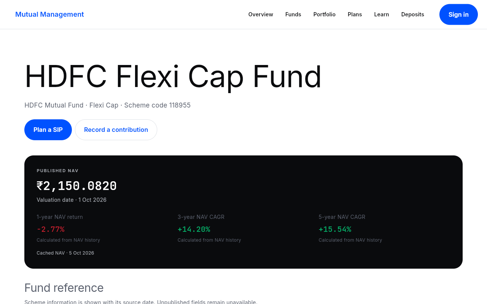

# Mutual Management

A Flutter web and Android app for learning about Indian mutual funds and practising goal-based investing. Accounts and cloud records are real; every contribution and SIP installment is explicitly simulated. No payments, debits, stock orders or deposit bookings occur.

[Live app](https://mutual-management.vercel.app) · [Android release](https://github.com/kadamsahil2511/mutual-management/releases/latest) · [Demo guide](docs/DEMO.md) · [Syllabus mapping](docs/SYLLABUS.md)

Version 1.1 adds an app-style phone layout: five bottom tabs, a compact dashboard, focused goal/SIP/contribution forms, activity and receipts, and a More hub for your account and tools. Desktop keeps its wider layout. [Mobile UX audit](docs/MOBILE_UX_AUDIT.md) · [Mobile Home](screenshots/mobile-v1.1-home.png) · [Funds](screenshots/mobile-v1.1-funds.png) · [New goal](screenshots/mobile-v1.1-newgoal.png).



## Features

- Overview, fund discovery, a five-question educational risk profile, two/three-fund comparison and dated scheme details.
- Email/password registration, sign-in, password reset and sign-out. New accounts start empty.
- Editable goals, monthly/quarterly SIP schedules, explicit installment confirmation, cancellation and one-off simulated contributions, with separate mobile forms and contribution receipts.
- Holdings derived from immutable contributions; current valuation, gain/loss, value-weighted sectors and disclosed-security overlap.
- Six original articles with official videos; SIP, lump-sum, goal and FD calculators.
- MFAPI NAV history with six-hour public caching, refresh, timeout, retry and cached/offline labels. Dated bank rates and source links.

Six Direct Growth funds cover HDFC/SBI Flexi Cap, Corporate Bond and Aggressive Hybrid. [Data sources](docs/DATA_SOURCES.md) explain provenance and coverage. Holdings are partial; unreported assets remain visible. Expense bases differ between these AMC disclosures, so the two-fund category average is explicitly unavailable. Planning assumptions default to 0% and do not promise returns.

## Run locally

Use Flutter **3.47.1** / Dart **3.13.1**, an Android SDK for Android builds, and Node 22 plus Java 21 for Firestore emulator tests.

```sh
flutter pub get
flutter run -d chrome
# Or select a connected Android device from flutter devices:
flutter run -d DEVICE_ID
```

Checked-in Firebase client identifiers connect to `device-streaming-f3ea5c85`, displayed as Mutual Management. Client API keys identify the project; owner-only Firestore rules protect records. No service-account keys, account passwords or signing credentials are in the repository. Records live under `mutualManagementUsers/{uid}` in the default `asia-south1` database. Persistent Firestore disk caching is disabled; only public NAV is saved in SharedPreferences. Firebase Authentication maintains the sign-in session until sign-out.

For an independent Firebase project, register web and Android apps (Android package `com.kadamsahil.mutual_management`), replace `lib/firebase_options.dart`, set `.firebaserc`, enable Email/Password Auth, create Firestore and deploy the included rules. Add your web hostname to Auth authorized domains. This app needs no custom server or billing upgrade.

## Verify

```sh
dart format --output=none --set-exit-if-changed lib test integration_test
flutter analyze
flutter test
npm ci --prefix firebase-tests
firebase-tests/node_modules/.bin/firebase emulators:exec --only firestore --project demo-mutual-management 'npm --prefix firebase-tests test'
flutter test integration_test/app_test.dart -d emulator-5554
```

The Firestore command uses a demo project and cannot write production data. For local Auth/Firestore development, start both emulators and use `flutter run -d chrome --dart-define=USE_EMULATORS=true`. Android emulator builds use `10.0.2.2`.

GitHub Actions runs formatting, analysis, unit/widget tests, a web release build and Firestore security tests on pushes and pull requests. See [verification evidence](docs/VERIFICATION.md).

## Build and publish

```sh
./scripts/package-web.sh
vercel link --project mutual-management --scope ksahil-team
vercel deploy --prebuilt
# After checking the preview:
vercel deploy --prebuilt --prod
```

The script copies Flutter's static release into Vercel Build Output API v3, with a filesystem-first fallback to `index.html` for deep links.

```sh
MUTUAL_SIGNING_PROPERTIES=/absolute/private/path/signing.properties flutter build apk --release
```

The external properties file contains `storeFile`, `storePassword`, `keyAlias` and `keyPassword`. Keep it and the keystore outside the repository and back them up privately for future updates. Without that variable, local builds use development signing. The delivered APK uses a private release key, supports Android API 24+, and is produced at `build/app/outputs/flutter-apk/app-release.apk`.

## Code map

`lib/features/` groups screens by feature. `lib/core/` contains the theme, shared widgets, providers, validation and calculations. Three concrete repositories handle Auth, public fund data and user records. Widgets use ordinary Flutter layouts and local form state; shared state uses manually declared Riverpod providers. Navigation uses `go_router`. Fonts and licenses are bundled in `assets/fonts/`.

Money is stored as integer paise. Contributions preserve units and the NAV/date used; no second portfolio balance is stored. Deterministic SIP IDs plus a Firestore transaction prevent duplicate installments. Calendar dates are stored at UTC midnight, and month-end schedules retain the original day.

This implements case study 132, “Grow Mutual Fund Investment.” Commits reflect actual work; classroom participation, handwritten exercises, peer assessment and an instructor's live surprise-feature assessment remain separate activities.
